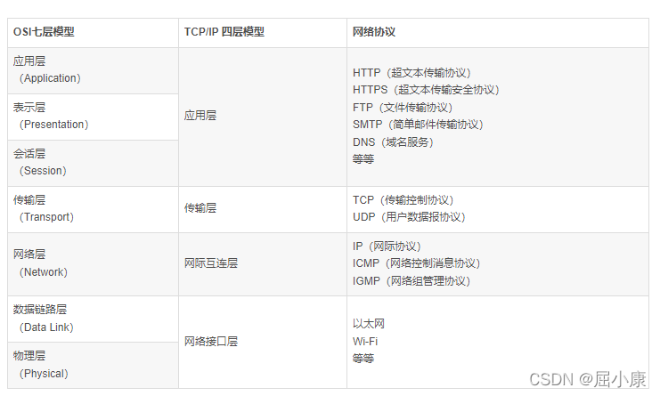

# 网络通信

**Q:** 网络通讯的结构：OSI七层模型，TCP/IP四层模型 和 网络协议？ 

**难度:**  &#x2B50;&#x2B50;

    
 A: 

--- 

**Q:** get与post 通讯的区别？ 
**难度:**  &#x2B50;&#x2B50;

    
 A: 

Get 请求能缓存，Post 不能

Post 相对Get 安全一点点，因为Get 请求都包含在URL 里，且会被浏览器保存历史纪录，Post 不会，但是在抓包的情况下都是一样的。

Post 可以通过request body来传输比Get 更多的数据，Get 没有这个技术

URL有长度限制，会影响Get 请求，但是这个长度限制是浏览器规定的，不是RFC 规定的

Post 支持更多的编码类型且不对数据类型限制

参考： http://static.kancloud.cn/codepan/senior-front-interview/730494

--- 

